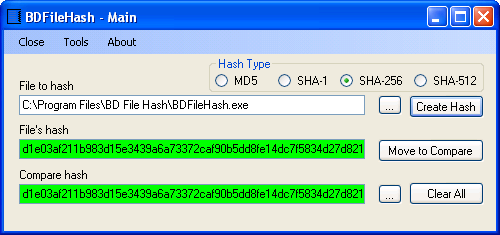
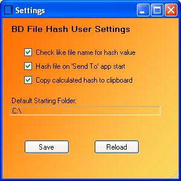
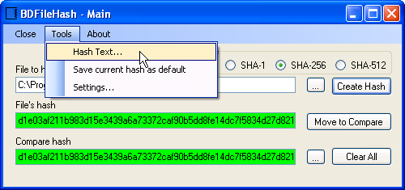
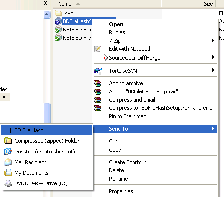
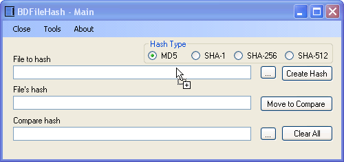

## Screen Shots

### The main screen:

### Settings screen

* +Check like file name for hash value:+
	* When hashing a file this option will check the same directory for a text file with a like name.  If it finds one that file will be parsed for a hash value of the same type hash algorithm selected.
* +Hash file on 'Send To' app start:+
	* When enabled the file which was "Sent To" BD File Hash will automatically be hashed when the application opens.
* +Copy calculated hash to clipboard:+ _**New**_
	* When enabled, the last calculated hash value will be copied to the clipboard.  Default on.
* +Default Starting Folder:+
	* Click on path to select a new default starting folder.
* +Save+
	* Saves current settings to user configuration file
* +Reload+
	* Reloads last saved values.  If no values have ever been saved, loads application defaults.

### Hash Text Screens
_**NEW**_ You can now hash any string!
Under the tools menu click **Text Hash...** to open a dialog to enter text.

Once you have the text entered/copied that you need to hash, click the **Hash Text** button.  The hash value will be written to the **File's hash** text box and the clipboard, if the option is enabled.

### Send To Application from Windows Explorer

Right click any file in Windows Explorer and choose "Send To" from the menu, then select **BD File Hash**    
BD File Hash will launch and load the file sent to it.

### Drag and Drop file onto text fields
_**NEW**_ Drop a file on **File to hash** or **File's hash** to calculate a hash for it.
